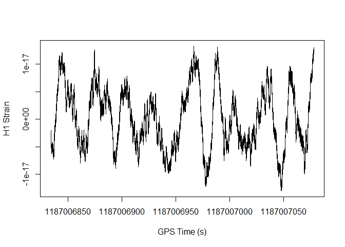

Лабораторна робота № 4. Формат HDF5.
================

##### В цій лабораторній роботі побудуємо за даними детектора гравітаційних волн LIGO графік злиття двох нейтронних зір. Подія GW170817 <https://uk.wikipedia.org/wiki/GW170817>. Лабораторну роботу створено на основі <https://losc.ligo.org/tutorial00/>

## Task 1.

##### Завантажте файл з даними за посиланням <https://dcc.ligo.org/public/0146/P1700337/001/H-H1_LOSC_C00_4_V1-1187006834-4096.hdf5>

``` r
download.file("https://dcc.ligo.org/public/0146/P1700337/001/H-H1_LOSC_C00_4_V1-1187006834-4096.hdf5","l_1.hdf5", "auto", TRUE, mode = "wb", cacheOK = FALSE)
```

## Task 2.

##### Встановить в R пакет для роботи з HDF5 файлами.

``` r
install.packages("BiocManager")
BiocManager::install("rhdf5")
```

``` r
library(rhdf5)
```

## Task 3.

###### Виведіть зміст файлу командою h5ls().

``` r
h5ls("l_1.hdf5")
```

    ##                  group            name       otype  dclass      dim
    ## 0                    /            meta   H5I_GROUP                 
    ## 1                /meta     Description H5I_DATASET  STRING    ( 0 )
    ## 2                /meta  DescriptionURL H5I_DATASET  STRING    ( 0 )
    ## 3                /meta        Detector H5I_DATASET  STRING    ( 0 )
    ## 4                /meta        Duration H5I_DATASET INTEGER    ( 0 )
    ## 5                /meta        GPSstart H5I_DATASET INTEGER    ( 0 )
    ## 6                /meta     Observatory H5I_DATASET  STRING    ( 0 )
    ## 7                /meta            Type H5I_DATASET  STRING    ( 0 )
    ## 8                /meta        UTCstart H5I_DATASET  STRING    ( 0 )
    ## 9                    /         quality   H5I_GROUP                 
    ## 10            /quality          detail   H5I_GROUP                 
    ## 11            /quality      injections   H5I_GROUP                 
    ## 12 /quality/injections InjDescriptions H5I_DATASET  STRING        5
    ## 13 /quality/injections   InjShortnames H5I_DATASET  STRING        5
    ## 14 /quality/injections         Injmask H5I_DATASET INTEGER     4096
    ## 15            /quality          simple   H5I_GROUP                 
    ## 16     /quality/simple  DQDescriptions H5I_DATASET  STRING        7
    ## 17     /quality/simple    DQShortnames H5I_DATASET  STRING        7
    ## 18     /quality/simple          DQmask H5I_DATASET INTEGER     4096
    ## 19                   /          strain   H5I_GROUP                 
    ## 20             /strain          Strain H5I_DATASET   FLOAT 16777216


## Task 4.

##### Зчитайте результати вимірів. Для цього зчитайте name Strain з групи strain в змінну strain. Після зчитування не забувайте закривати файл командою H5Close().

``` r
h5f = H5Fopen("l_1.hdf5")
strain <- h5f$"/strain/Strain"
H5close()
head(strain, n = 100)
```

    ##   [1] -2.391646e-18 -2.411660e-18 -2.427382e-18 -2.426351e-18 -2.427996e-18
    ##   [6] -2.446291e-18 -2.462962e-18 -2.463456e-18 -2.464039e-18 -2.481933e-18
    ##  [11] -2.499762e-18 -2.499653e-18 -2.499740e-18 -2.514827e-18 -2.534504e-18
    ##  [16] -2.539017e-18 -2.534552e-18 -2.547276e-18 -2.567941e-18 -2.573345e-18
    ##  [21] -2.569082e-18 -2.580038e-18 -2.601175e-18 -2.606781e-18 -2.602693e-18
    ##  [26] -2.610871e-18 -2.633490e-18 -2.643470e-18 -2.636836e-18 -2.644074e-18
    ##  [31] -2.664256e-18 -2.672044e-18 -2.668297e-18 -2.674602e-18 -2.694475e-18
    ##  [36] -2.704304e-18 -2.701060e-18 -2.704327e-18 -2.721023e-18 -2.736411e-18
    ##  [41] -2.734468e-18 -2.734657e-18 -2.750277e-18 -2.764038e-18 -2.762714e-18
    ##  [46] -2.760657e-18 -2.775542e-18 -2.791775e-18 -2.792872e-18 -2.789694e-18
    ##  [51] -2.802051e-18 -2.818514e-18 -2.819640e-18 -2.817563e-18 -2.825702e-18
    ##  [56] -2.840493e-18 -2.844911e-18 -2.840323e-18 -2.849236e-18 -2.864024e-18
    ##  [61] -2.866516e-18 -2.864561e-18 -2.870113e-18 -2.884157e-18 -2.892315e-18
    ##  [66] -2.886803e-18 -2.888990e-18 -2.905280e-18 -2.910579e-18 -2.905710e-18
    ##  [71] -2.907789e-18 -2.918407e-18 -2.929630e-18 -2.924219e-18 -2.920615e-18
    ##  [76] -2.935474e-18 -2.945064e-18 -2.941400e-18 -2.938474e-18 -2.948497e-18
    ##  [81] -2.958899e-18 -2.953137e-18 -2.947170e-18 -2.958416e-18 -2.969287e-18
    ##  [86] -2.965243e-18 -2.960560e-18 -2.965839e-18 -2.977932e-18 -2.977669e-18
    ##  [91] -2.966931e-18 -2.973528e-18 -2.984989e-18 -2.982362e-18 -2.976018e-18
    ##  [96] -2.976060e-18 -2.985538e-18 -2.990464e-18 -2.980658e-18 -2.979012e-18

## Task 5.

##### Також з «strain/Strain» зчитайте атрибут (функція h5readAttributes) Xspacing в змінну st та виведіть її. Це інтервал часу між вимірами.

``` r
h5f = H5Fopen("l_1.hdf5")
attrs = h5readAttributes(h5f, "strain/Strain")
st <- attrs$Xspacing
st
```

    ## [1] 0.0002441406

## Task 6.

##### Знайдіть час початку події та її тривалість. Для цього з групи meta зчитайте в змінну gpsStart name GPSstart та в змінну duration name Duration.

``` r
h5f = H5Fopen("l_1.hdf5")
gpsStart <- h5f$"meta/GPSstart"
duration <- h5f$"meta/Duration"
H5close()
gpsStart
```

    ## [1] 1187006834

``` r
duration
```

    ## [1] 4096

## Task 7.

##### Знайдіть час закінчення події та збережіть його в змінну gpsEnd.

``` r
gpsEnd <- gpsStart + duration
gpsEnd
```

    ## [1] 1187010930

## Task 8.

##### Створіть вектор з часу вимірів і збережіть у змінну myTime. Початок послідовності – gpsStart, кінець – gpsEnd, крок – st.

``` r
myTime <- seq(gpsStart, gpsEnd, st)
head(myTime, n = 100)
```

    ##   [1] 1187006834 1187006834 1187006834 1187006834 1187006834 1187006834
    ##   [7] 1187006834 1187006834 1187006834 1187006834 1187006834 1187006834
    ##  [13] 1187006834 1187006834 1187006834 1187006834 1187006834 1187006834
    ##  [19] 1187006834 1187006834 1187006834 1187006834 1187006834 1187006834
    ##  [25] 1187006834 1187006834 1187006834 1187006834 1187006834 1187006834
    ##  [31] 1187006834 1187006834 1187006834 1187006834 1187006834 1187006834
    ##  [37] 1187006834 1187006834 1187006834 1187006834 1187006834 1187006834
    ##  [43] 1187006834 1187006834 1187006834 1187006834 1187006834 1187006834
    ##  [49] 1187006834 1187006834 1187006834 1187006834 1187006834 1187006834
    ##  [55] 1187006834 1187006834 1187006834 1187006834 1187006834 1187006834
    ##  [61] 1187006834 1187006834 1187006834 1187006834 1187006834 1187006834
    ##  [67] 1187006834 1187006834 1187006834 1187006834 1187006834 1187006834
    ##  [73] 1187006834 1187006834 1187006834 1187006834 1187006834 1187006834
    ##  [79] 1187006834 1187006834 1187006834 1187006834 1187006834 1187006834
    ##  [85] 1187006834 1187006834 1187006834 1187006834 1187006834 1187006834
    ##  [91] 1187006834 1187006834 1187006834 1187006834 1187006834 1187006834
    ##  [97] 1187006834 1187006834 1187006834 1187006834

## Task 9.

##### Побудуємо графік тільки для першого мільйону вимірів. Для цього створіть змінну numSamples, яка дорівнює 1000000.

``` r
numSamples = 1000000
numSamples
```

    ## [1] 1e+06

## Task 10.

##### Побудуйте графік за допомогою функції plot(myTime\[0:numSamples\], strain\[0:numSamples\], type = “l”, xlab = “GPS Time (s)”, ylab = “H1 Strain”).

``` r
plot(myTime[0:numSamples], strain[0:numSamples], type = "l", xlab = "GPS Time (s)", ylab = "H1 Strain")
```

<!-- -->
